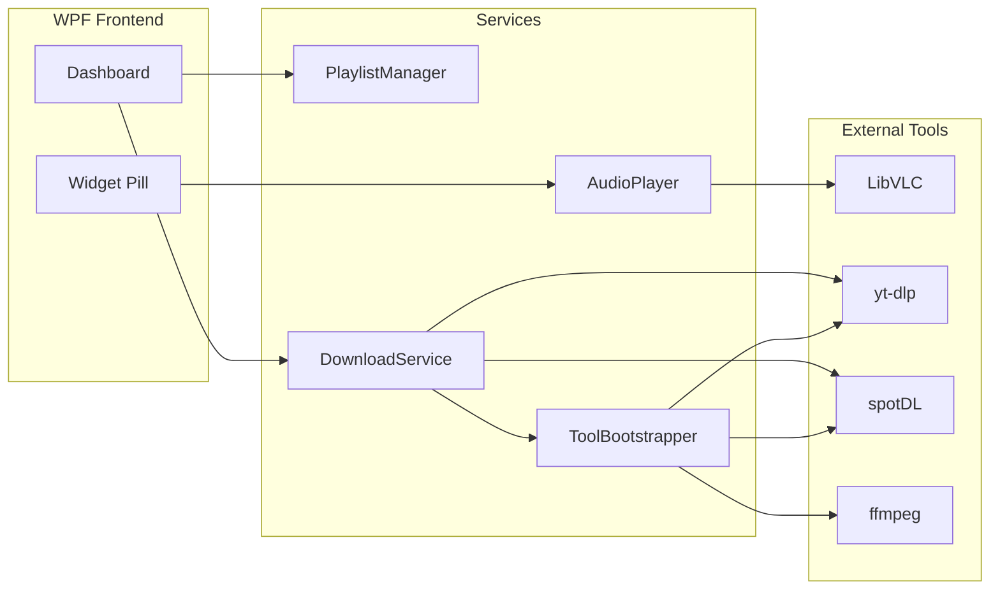

<div align="center">

# Beats

**A floating desktop music player for Windows.**  
Play local playlists, download tracks from the web, and control everything from a minimal always-on-top widget.

[](https://github.com/Delexoo/beats/releases/latest)
[](https://github.com/Delexoo/beats/releases/latest)
[](https://dotnet.microsoft.com/download/dotnet/8.0)
[](LICENSE)
[](https://delexoo.github.io/beats/)
[](https://github.com/Delexoo/beats/stargazers)

<br />

[**Download for Windows**](https://github.com/Delexoo/beats/releases/latest/download/Beats-Setup-x64.exe)
&nbsp;|&nbsp;
[**Help &amp; manual**](https://delexoo.github.io/beats/help.html)
&nbsp;|&nbsp;
[**Website**](https://delexoo.github.io/beats/)
&nbsp;|&nbsp;
[**Releases**](https://github.com/Delexoo/beats/releases)
&nbsp;|&nbsp;
[**Report an issue**](https://github.com/Delexoo/beats/issues)

<br />

<sub>Free | No account required | x64 only</sub>

</div>

---

## Table of contents

- [Overview](#overview)
- [What's new](#whats-new)
- [Website](#website)
- [Preview](#preview)
- [Quick start](#quick-start)
- [Features](#features)
- [Keyboard shortcuts](#keyboard-shortcuts)
- [Supported sources](#supported-sources)
- [System requirements](#system-requirements)
- [Installation](#installation)
- [Where your data lives](#where-your-data-lives)
- [Tech stack](#tech-stack)
- [Project structure](#project-structure)
- [Development](#development)
- [Troubleshooting](#troubleshooting)
- [License](#license)
- [Acknowledgments](#acknowledgments)

---

## Overview

**Beats** is a frameless, always-on-top desktop widget for Windows. It keeps your music one glance away while you work, game, or browse - without cluttering the taskbar.

| | |
|---|---|
| **Local playback** | Folder-based playlists under `My Music\Beats` - portable, editable, and yours |
| **Web downloads** | Paste a URL; Beats saves MP3s into the playlist you choose |
| **Minimal UI** | A draggable pill with album art, transport controls, and an expandable dashboard |
| **Stay out of the way** | Hide off-screen with `Alt` + `\` or the top-screen chevron; bring it back instantly |

Built with **WPF** and **.NET 8**, powered by **LibVLC** for playback and **yt-dlp** / **spotDL** / **ffmpeg** for downloads (bootstrapped automatically on first use).

---

## What's new

**Latest: v2.2.18** — [Full changelog](CHANGELOG.md) | [Release notes](https://github.com/Delexoo/beats/releases/latest)

- **Playlist accordion** — expand playlists inline; click anywhere on the row header to open or close
- **Track artwork** — album covers in playlist song lists with smart caching
- **Click-outside to close** — the dashboard auto-minimizes when you click the player or another app
- **Headset controls** — play, pause, and skip from media keys (AirPods, keyboard, etc.)
- **In-app updates** — check and install new versions from the dashboard toolbar
- **Performance** — faster refreshes, smoother scrolling, and more responsive UI

---

## Website

The project site is hosted on **GitHub Pages** at **[delexoo.github.io/beats](https://delexoo.github.io/beats/)**.

<div align="center">
    
<br />

[**Open the website**](https://delexoo.github.io/beats/) | [**Help & manual**](https://delexoo.github.io/beats/help.html)

</div>

| Page | URL | What you'll find |
|---|---|---|
| **Home** | [delexoo.github.io/beats](https://delexoo.github.io/beats/) | Download, features, how it works, interactive widget preview |
| **Help** | [delexoo.github.io/beats/help.html](https://delexoo.github.io/beats/help.html) | Full user manual - setup, shortcuts, downloads, troubleshooting |

The site lives in the [`website/`](website/) folder and deploys automatically when you push to `main` (see [Deploy the website](#deploy-the-website-github-pages) below).

---

## Preview

> **Live demo:** open the [project website](https://delexoo.github.io/beats/) for an interactive preview of the widget on a Windows 11 desktop.

<!-- Add a screenshot once available, e.g.:

-->

---

## Quick start

<details open>
<summary><strong>Get running in under a minute</strong></summary>

<br />

1. **Download** the latest installer: [Beats-Setup-x64.exe](https://github.com/Delexoo/beats/releases/latest/download/Beats-Setup-x64.exe)
2. **Run** the installer and launch Beats from the Start menu.
3. **Open the dashboard** - click the settings gear on the pill, or press `Ctrl` + `\`.
4. **Create a playlist** - use **New Playlist** in the dashboard sidebar.
5. **Add music** - drag files into a playlist folder, or paste a URL to download.

On first download, Beats silently fetches `yt-dlp`, `ffmpeg`, and (for Spotify) `spotDL` into `%APPDATA%\Beats\tools`. This is a one-time setup (~130 MB total).

</details>

---

## Features

### At a glance

| Category | Highlights |
|---|---|
| **Widget** | Always on top | draggable | no taskbar icon | hover to expand loop & settings |
| **Dashboard** | Playlists | track list | seek bar | volume | liked & saved songs |
| **Playback** | Play / pause | previous / next | shuffle | loop current | LibVLC engine |
| **Library** | Folder playlists | pin favorites | custom sort order | live folder watching |
| **Downloads** | YouTube | Spotify | TikTok | SoundCloud | Instagram | 1000+ sites via yt-dlp |
| **Quality of life** | Global hotkeys | top chevron hide tab | resizable dashboard | crash logging |

<details>
<summary><strong>Widget &amp; playback</strong></summary>

<br />

- **Floating pill widget** - dark rounded bar with album art, title, artist, and transport controls
- **Always on top** - stays visible over any application; no taskbar entry
- **Draggable** - grab the album art to reposition anywhere on screen
- **Hover expand** - loop and settings controls appear on hover (or keep them pinned in settings)
- **Hide & show** - slide off the nearest screen edge via `Alt` + `\` or the top-center chevron tab
- **Shuffle & loop** - toggle shuffle for the queue; loop the current track independently
- **Volume control** - adjustable from the dashboard footer
- **Rich formats** - MP3, WAV, FLAC, M4A, AAC, OGG, Opus, WMA, AIFF, ALAC

</details>

<details>
<summary><strong>Playlists &amp; library</strong></summary>

<br />

- **Folder-based playlists** - each playlist is a folder under your music root (default: `My Music\Beats`)
- **Portable library** - copy, back up, or sync folders like any other files on disk
- **Create | rename | delete** - full playlist management from the dashboard
- **Add from disk** - import existing audio files into any playlist
- **Liked Songs & Saves** - built-in collections separate from normal playlists
- **Pin playlists** - right-click to pin favorites above the Liked/Saves divider
- **Custom order** - drag to reorder playlists and tracks; order persists across sessions
- **Live updates** - file system watchers refresh track lists when files change on disk
- **Album artwork** - embedded art, sidecar images, disk cache, and online lookup in playlist rows
- **Playlist accordion** - expand and collapse playlists inline in the dashboard sidebar

</details>

<details>
<summary><strong>Web downloads</strong></summary>

<br />

- **Paste any URL** - download dialog accepts links from supported platforms
- **YouTube** - videos, playlists, and channels via yt-dlp nightly builds with multi-client fallbacks
- **Spotify** - tracks, albums, and playlists via spotDL v4 (with metadata)
- **Social & audio sites** - TikTok, SoundCloud, Instagram Reels audio, and any site yt-dlp supports
- **Progress tracking** - live percentage and item counts during batch downloads
- **YouTube cookies (optional)** - import a Netscape `cookies.txt` when downloads are blocked or rate-limited
- **Smart URL cleanup** - strips tracking parameters from YouTube, Instagram, TikTok, and other social links; normalizes Instagram reel/share/profile URLs and unwraps `l.instagram.com` redirects
- **Instagram fallbacks** - embed pages, mobile client headers, direct media discovery, and YouTube search for audio-only pages

</details>

<details>
<summary><strong>Dashboard &amp; settings</strong></summary>

<br />

- **Resizable dashboard** - drag edges to resize; `Ctrl` + `Shift` + `\` resets layout to defaults
- **Auto-minimize** - click outside the dashboard (player pill or desktop) to close it instantly
- **Track list zoom** - `Ctrl` + scroll to scale song rows
- **In-app updates** - check for new versions and install from the dashboard toolbar
- **Configurable music root** - change where playlists are stored
- **In-app help** - Quick start, YouTube cookies guide, and shortcuts reference
- **Single instance** - only one Beats process runs at a time

</details>

---

## Keyboard shortcuts

| Action | Shortcut |
|---|---|
| Hide or show widget | `Alt` + `\` |
| Open or close dashboard | `Ctrl` + `\` |
| Reset widget position & dashboard size | `Ctrl` + `Shift` + `\` |
| Scale track list (in dashboard) | `Ctrl` + scroll |

<details>
<summary><strong>Mouse gestures</strong></summary>

<br />

| Gesture | Action |
|---|---|
| **Drag album art** | Move the widget anywhere on screen |
| **Click outside dashboard** | Close the dashboard; keep the player visible |
| **Top chevron tab** | Same as `Alt` + `\` - toggle widget visibility |
| **Hover pill** | Reveal loop and settings controls (unless pinned open) |
| **Click settings gear** | Open the dashboard |

</details>

> **Note:** Hotkeys use the `\` (backslash) key on US layouts. If a combo is already registered by another app, the chevron tab and on-screen buttons still work.

---

## Supported sources

<details>
<summary><strong>Platforms with first-class support</strong></summary>

<br />

| Platform | Method | Notes |
|---|---|---|
| **YouTube** | yt-dlp | Videos, playlists, channels; optional cookies for restricted content |
| **Spotify** | spotDL | Tracks, albums, playlists with metadata |
| **Instagram** | yt-dlp | Reels, posts, IGTV, and share links; embed + mobile client fallbacks; audio pages search YouTube; optional cookies for login-only links |
| **TikTok** | yt-dlp | Short links auto-resolved; mobile/app API fallbacks |
| **SoundCloud** | yt-dlp | Tracks and sets |

</details>

<details>
<summary><strong>Everything else yt-dlp supports</strong></summary>

<br />

Beats delegates generic URLs to [yt-dlp](https://github.com/yt-dlp/yt-dlp), which supports **1,000+ sites**. If yt-dlp can extract audio from a link, Beats can download it as MP3.

Spotify links always route through spotDL regardless of URL pattern.

</details>

---

## System requirements

| Requirement | Details |
|---|---|
| **OS** | Windows 10 or Windows 11 (64-bit) |
| **Runtime** | [.NET 8 Desktop Runtime](https://dotnet.microsoft.com/download/dotnet/8.0) (included in the installer) |
| **Disk space** | ~50 MB app + ~130 MB tools on first download |
| **Network** | Required for initial tool bootstrap and web downloads |

---

## Installation

<details open>
<summary><strong>End users - installer (recommended)</strong></summary>

<br />

Download the latest release:

**[Beats-Setup-x64.exe](https://github.com/Delexoo/beats/releases/latest/download/Beats-Setup-x64.exe)**

The installer registers Beats in the Start menu and handles the .NET 8 Desktop Runtime dependency.

</details>

<details>
<summary><strong>First-run tool bootstrap</strong></summary>

<br />

On the first web download, Beats automatically downloads these tools into `%APPDATA%\Beats\tools`:

| Tool | Size (approx.) | Purpose |
|---|---|---|
| `yt-dlp.exe` | ~10 MB | Extract audio from web URLs (nightly build) |
| `ffmpeg.exe` | ~80 MB | Transcode and mux audio |
| `spotdl.exe` | ~42 MB | Spotify track/album/playlist downloads |

After the initial bootstrap, all downloads run locally with no additional setup.

</details>

---

## Where your data lives

<details>
<summary><strong>Application data</strong> - <code>%APPDATA%\Beats\</code></summary>

<br />

```
%APPDATA%\Beats\
├── settings.json           # Preferences, window layout, volume, etc.
├── liked-songs.json        # Liked Songs collection
├── saved-songs.json        # Saves collection
├── playlist-orders.json    # Custom playlist & track ordering
├── artwork\                # Cached album art
└── tools\
    ├── yt-dlp.exe
    ├── ffmpeg.exe
    └── spotdl.exe
```

</details>

<details>
<summary><strong>Music library</strong> - default <code>%USERPROFILE%\Music\Beats\</code></summary>

<br />

```
%USERPROFILE%\Music\Beats\     (configurable in settings)
├── My Playlist\
│   ├── Artist - Song.mp3
│   └── ...
├── Workout Mix\
│   └── ...
└── ...
```

Each subfolder is a playlist. Add, remove, or rename files directly in Explorer - Beats picks up changes automatically.

</details>

---

## Tech stack

| Layer | Technology |
|---|---|
| **UI** | WPF (.NET 8, x64) |
| **Playback** | [LibVLCSharp](https://github.com/videolan/libvlcsharp) + VideoLAN.LibVLC |
| **Metadata** | [TagLib#](https://github.com/mono/taglib-sharp) |
| **Downloads** | [yt-dlp](https://github.com/yt-dlp/yt-dlp) | [spotDL](https://github.com/spotDL/spotify-downloader) | [ffmpeg](https://ffmpeg.org/) |
| **Installer** | [Inno Setup 6](https://jrsoftware.org/isdl.php) |
| **CI/CD** | GitHub Actions (release + Pages deploy) |
| **Website** | Static HTML landing page on GitHub Pages |



---

## Project structure

```
beats/
├── MusicWidget/              # WPF application (AssemblyName: Beats)
│   ├── Views/                # Widget, dashboard, dialogs
│   ├── Services/             # Audio, downloads, playlists, hotkeys, updates
│   ├── Models/               # Settings, tracks, playlists
│   └── Resources/            # Styles and assets
├── Installer/                # Inno Setup script + build scripts
├── website/                  # GitHub Pages landing page
├── .github/workflows/        # Release & Pages CI
├── CHANGELOG.md              # Version history
├── version.json              # Version + installer asset name
└── MusicWidget.sln
```

---

## Development

<details>
<summary><strong>Build &amp; run from source</strong></summary>

<br />

**Prerequisites:** [.NET 8 SDK](https://dotnet.microsoft.com/download/dotnet/8.0)

```powershell
git clone https://github.com/Delexoo/beats.git
cd beats
dotnet restore
dotnet build -c Release
dotnet run --project MusicWidget -c Release
```

</details>

<details>
<summary><strong>Build the Windows installer</strong></summary>

<br />

**Prerequisites:** [.NET 8 SDK](https://dotnet.microsoft.com/download/dotnet/8.0) | [Inno Setup 6](https://jrsoftware.org/isdl.php)

```powershell
powershell -ExecutionPolicy Bypass -File Installer\Build-Installer.ps1
```

Output: `Installer\Output\Beats-Setup-x64.exe`

</details>

<details>
<summary><strong>Publish a release</strong></summary>

<br />

Releases are built automatically by GitHub Actions when you push a version tag:

```powershell
git tag v2.2.0
git push origin v2.2.0
```

Or trigger manually: **Actions -> Release -> Run workflow**.

Each release uploads `Beats-Setup-x64.exe` under a stable filename so the website and README download links always resolve to the latest build.

</details>

<details>
<summary><strong>Deploy the website (GitHub Pages)</strong></summary>

<br />

The landing page in `/website` deploys automatically on push to `main`.

Manual setup (one-time): **Settings -> Pages -> Source:** Deploy from branch `main`, folder `/website`.

Live URL: **[delexoo.github.io/beats](https://delexoo.github.io/beats/)**

</details>

---

## Troubleshooting

<details>
<summary><strong>YouTube downloads fail or say &quot;Sign in&quot;</strong></summary>

<br />

YouTube occasionally blocks automated downloads. In the dashboard help section, follow the **YouTube cookies** guide to export a Netscape-format `cookies.txt` from your browser and point Beats to it in settings.

Beats also retries with multiple yt-dlp player clients automatically before giving up.

</details>

<details>
<summary><strong>Hotkeys don&apos;t work</strong></summary>

<br />

Another application may have registered the same key combo. Use the top chevron tab or on-screen buttons instead. Only one Beats instance can register hotkeys at a time.

</details>

<details>
<summary><strong>Spotify download is slow the first time</strong></summary>

<br />

The first Spotify download also bootstraps spotDL and its Deno dependency. Subsequent Spotify downloads are much faster.

</details>

<details>
<summary><strong>Find crash logs</strong></summary>

<br />

Beats writes crash logs to `%APPDATA%\Beats\` for unexpected errors. Include these when [opening an issue](https://github.com/Delexoo/beats/issues).

</details>

---

## License

MIT - see [LICENSE](LICENSE).

Copyright © 2026 [Delexo](https://delexo.store) | [@Delexoo on GitHub](https://github.com/Delexoo)

[Changelog](CHANGELOG.md) · [Contributing](CONTRIBUTING.md) · [Security](SECURITY.md)

---

## Acknowledgments

Beats builds on excellent open-source projects. Thank you to the authors, maintainers, and contributors of each project below.

**Core download and playback**

| Project | Role in Beats |
|---|---|
| [yt-dlp](https://github.com/yt-dlp/yt-dlp) | Primary web media extraction engine (YouTube, Instagram, TikTok, and 1,000+ sites) |
| [spotDL](https://github.com/spotDL/spotify-downloader) | Spotify track, album, and playlist downloads with metadata |
| [ffmpeg](https://ffmpeg.org/) | Audio transcoding and muxing |
| [LibVLC / LibVLCSharp](https://github.com/videolan/libvlcsharp) | Local playback engine |
| [TagLib#](https://github.com/mono/taglib-sharp) | Album art and audio metadata |

**Instagram download references**

Reliability patterns (URL cleanup, headers, embed fallbacks, and page metadata) were informed by:

- [instaloader](https://github.com/instaloader/instaloader) - Instagram metadata and session-aware media tooling
- [InstaDownload](https://github.com/Orang-Studio/InstaDownload) - lightweight public reel downloads on device
- [Instagram-reels-downloader](https://github.com/Okramjimmy/Instagram-reels-downloader) - reel URL handling and extraction approaches
- [reclip](https://github.com/averygan/reclip) - yt-dlp-based multi-site downloader UI

**TikTok download references**

- [tiktok-downloader](https://github.com/w3kp/tiktok-downloader) - TikTok link handling patterns
- [tiktok-to-ytdlp](https://github.com/dinoosauro/tiktok-to-ytdlp) - TikTok URL normalization for yt-dlp

**Spotify and multi-platform download references**

- [spotify-dl](https://github.com/SwapnilSoni1999/spotify-dl) - Spotify download workflows
- [spud](https://github.com/LUIDevo/spud) - Spotify playlist tooling with yt-dlp
- [Meloetta](https://github.com/Lacrymosaa/Meloetta) - spotDL GUI patterns
- [spotwrap](https://github.com/Didiloy/spotwrap) - spotDL desktop wrapper
- [Spotifyte](https://github.com/rohankishore/Spotifyte) - spotDL desktop integration
- [zotify](https://github.com/zotify-dev/zotify) - Spotify download tooling
- [OnTheSpot](https://github.com/ots-downloader/onthespot) - multi-service music downloader
- [SpotiFlyer](https://github.com/Shabinder/SpotiFlyer) - multi-platform music downloader
- [savify](https://github.com/LaurenceRawlings/savify) - Spotify-to-local-file workflows

**Web and API wrapper references**

- [yt-dlp-web](https://github.com/brenard/yt-dlp-web) - yt-dlp as a web service

<div align="center">

<br />

**[Download Beats](https://github.com/Delexoo/beats/releases/latest/download/Beats-Setup-x64.exe)** | **[Website](https://delexoo.github.io/beats/)** | **[Help](https://delexoo.github.io/beats/help.html)** | **[Star on GitHub](https://github.com/Delexoo/beats)**

</div>
